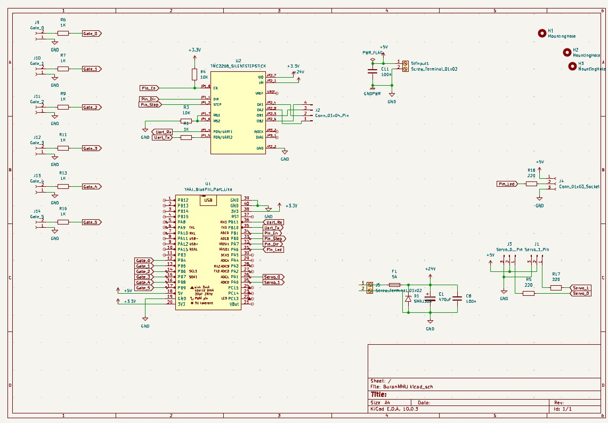
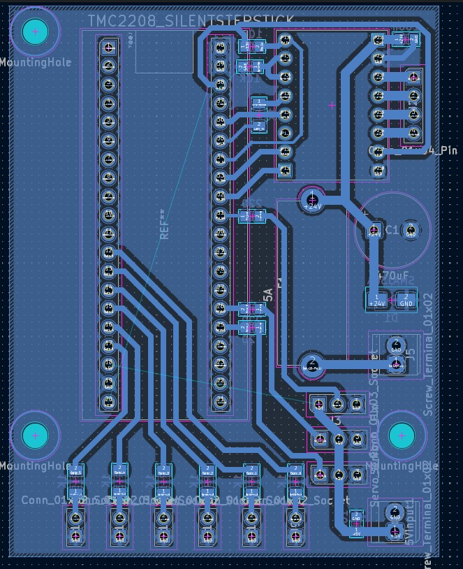

# Ender3V3KE_BuranMMU

Adding a multi-material unit for my Ender 3 V3 KE.

This project is split into 3 parts: **Hardware**, **Electronics**, and **Software**.

## Overview

A custom multi-material unit (MMU) built around 3D-printed hardware, a custom PCB, and Klipper-based control software (SimpleAF + Happy Hare).

---

## 1. Hardware

On the hardware side, this build uses **Lowrider** as the MMU unit. Feel free to swap in a different MMU design to suit your own printer.

### 3D Printed Parts

| Part | Link |
|---|---|
| Lowrider MMU v2.0 | [printables.com/model/1592898](https://www.printables.com/model/1592898-low-rider-mmu-v20-for-any-klipper-printer) |
| Purge Bucket (Ender 3 V3 SE) | [printables.com/model/1789345](https://www.printables.com/model/1789345-purge-chute-for-ender-3-v3-se) |
| Toolhead Hub (Ender 3 V3 SE, Pico MMU) | [printables.com/model/1689976](https://www.printables.com/model/1689976-ender-3-v3-se-filament-hub-for-pico-mmu) |
| Servo Filament Cutter (Ender 3 V3 KE) | [printables.com/model/1433552](https://www.printables.com/model/1433552-filament-cutter-creality-ender-3-v3-ke) |
---

## 2. Electronics

The electronics are built around a **custom PCB** designed specifically for this project (schematic/Gerbers included in this repo).

- Stm32F103C8t6 boards used
- TMC2208
- Sensor wiring
- 24V that powered from the printer PSU

---

## 3. Software

The MMU is controlled using **[Happy Hare](https://github.com/moggieuk/Happy-Hare)** together with **[SimpleAF](https://github.com/moggieuk/SimpleAF)**, both running on top of Klipper.

- **Happy Hare** — core MMU logic/state machine for Klipper
- **SimpleAF** — simplified configuration/macro layer on top of Happy Hare
